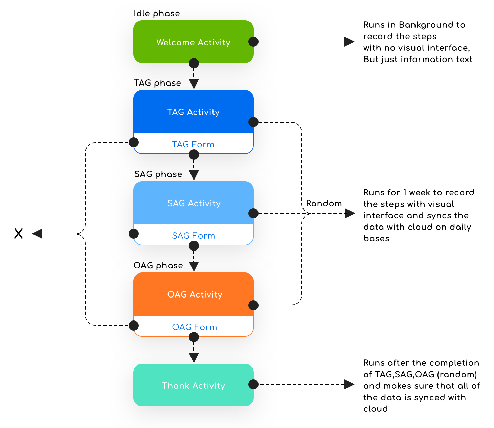

# PersuasiveGoals
The GIT cotains the source code for the thesis work titled as Enhancing the Persuasiveness – Behavior Change Intentions and the Perception of Achievement Goals for Physical Activity writtent and submitted by Atiq-Ur-Rehman Waqar under the supervision of <br />
[Prof. Dr. Antonio Krüger](https://umtl.cs.uni-saarland.de/people/prof.-dr.-antonio-kr%C3%BCger.html)<br />
German Research Center for Artificial Intelligence <br />
Saarland Informatics Campus <br />
Saarbrücken, Germany <br />

# Published Article 
Design Guidelines to Increase the Persuasiveness of Achievement Goals for Physical Activity

# Authors
[Maximilian Altmeyer](https://umtl.cs.uni-saarland.de/people/maximilian-altmeyer.html), [Pascal Lessel](https://umtl.cs.uni-saarland.de/people/pascal-lessel.html), [Atiq Ur Rehman Waqar](https://atiq.eu/), [Antonio Krüger](https://umtl.cs.uni-saarland.de/people/prof.-dr.-antonio-kr%C3%BCger.html)

# Web Application
The web application was developed to better understand the designed visualisations of different goal types in the development environment, which later led to the development of a native Android application named as GOALS. The demo of [Web Application](https://persuasivegoals.com/) is available on [Public URL](https://persuasivegoals.com/) maintained by [Atiq Ur Rehman Waqar](https://atiq.eu/)

# Android Application
The GOALS application makes the use of a step counter sensor. A sensor of this type returns the number of steps taken by the user since the last reboot while activated. Step counter sensor is either hardware-based or software-based which is defined in the Hardware Abstraction Layer (HAL). Hardware Abstraction Layer is the interface between the hardware drivers and the Android framework. In order to handle the reboot, the local database was used to keep the previous values before reboot. 

The GOALS application is divided into 4 different phases (Idle, TAG, SAG and OAG phase - other than an idle phase, every phase is comprised of associated visualisation and associated feedback form). The idle phase is the very first phase to be experienced by participants. TAG, SAG and OAG phases are developed to be randomised so that each participant gets a unique way of interaction. For each goal type, the step count cycle is 12,000 steps.


## Activity Level Structure
The visual represents the structure of visualisations where X means the next activity will only start when the feedback form is submitted successfully. In case the form was delayed, the time for the next activity will only start after the submission of the feedback form.




# How To 
### Clone Git Repository Locally
[Read Bit Bucket Documentation](https://www.atlassian.com/git/tutorials/setting-up-a-repository/git-clone)

### Web Application Demo
[Public URL - Demo](https://persuasivegoals.com/) 

### Android Application Demo
> #### Android Application - Local Client
Please follow following steps to run the application
1. Install [Android Studio](https://developer.android.com/studio) in your local machine
1. Enable USB debugging in the [Developer options](https://developer.android.com/studio/debug/dev-options)  | [[Reference]](https://developer.android.com/training/basics/firstapp/running-app) 
    1. Open the Settings app.
    1. If your device uses Android v8.0 or higher, select System. Otherwise, proceed to the next step.
    1. Scroll to the bottom and select About phone.
    1. Scroll to the bottom and tap Build number seven times.
    1. Return to the previous screen, scroll to the bottom, and tap Developer options.
    1. In the Developer options window, scroll down to find and enable USB debugging.  
1. Connect your Android device to your local machine with a USB cable in 
1. Run the app on your device as follows:
    1. In Android Studio, select your app from the run/debug configurations drop-down menu in the toolbar.
    1. In the toolbar, select the device that you want to run your app on from the target device drop-down menu.
    


> #### Android Application - Web Client

* Upload 'test' folder to your desired cloud (PersuasiveGoals/Android App/Server Node/test)
* Go to java > com.example.goals > RetrofitClient and update BaseUrl (this is the directory where the database of each client node will be synced with cloud)
```
baseUrl("https://atiq.eu/test/")
```
* To update the path for average value of Others Step Count in Other-approach Goals, look for the 'doInBackground' function in java > com.example.goals > OagActivity and change the URL to
```
String url = "https://atiq.eu/test/default";
```